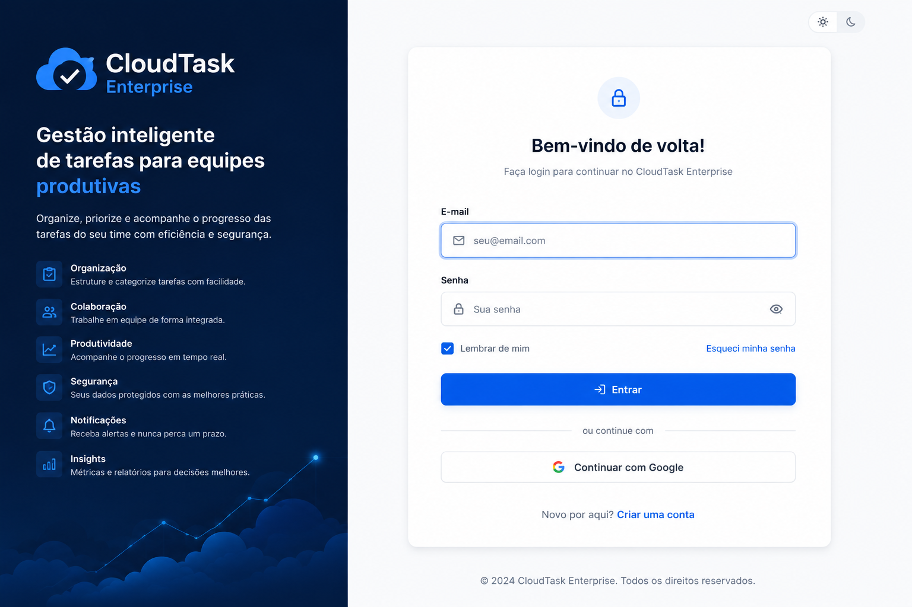
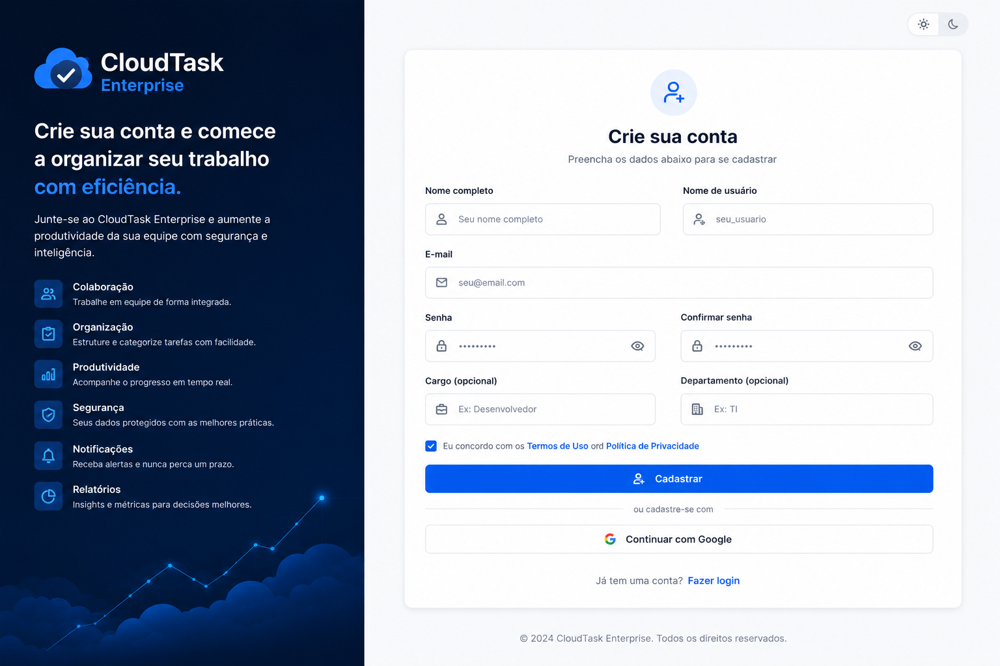
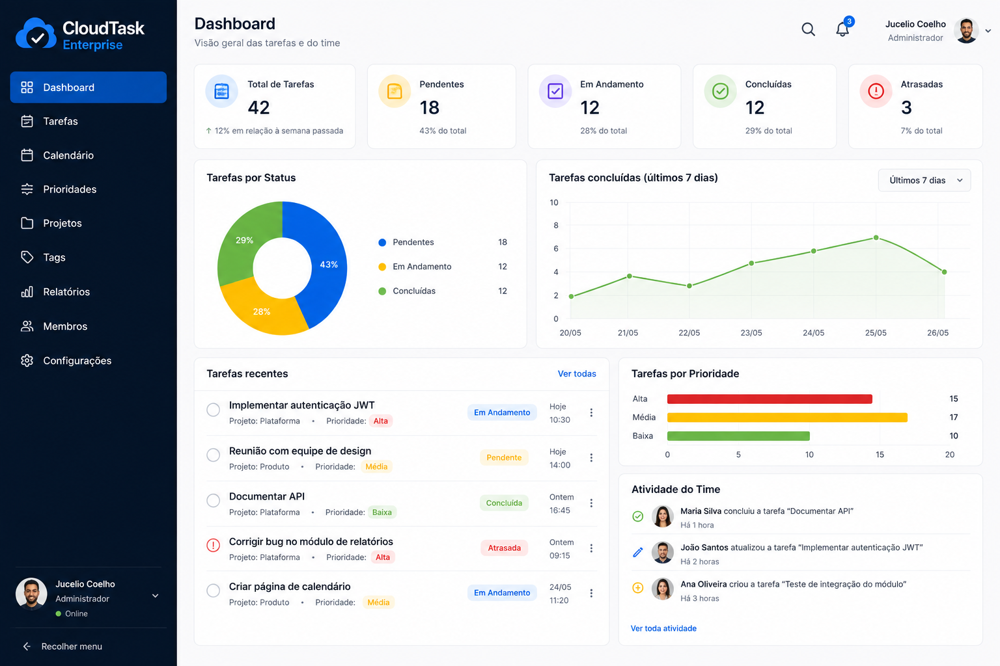
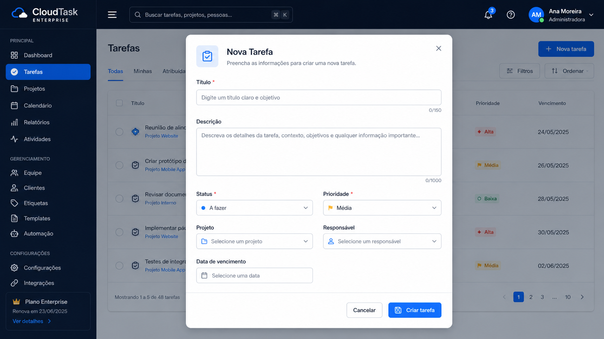
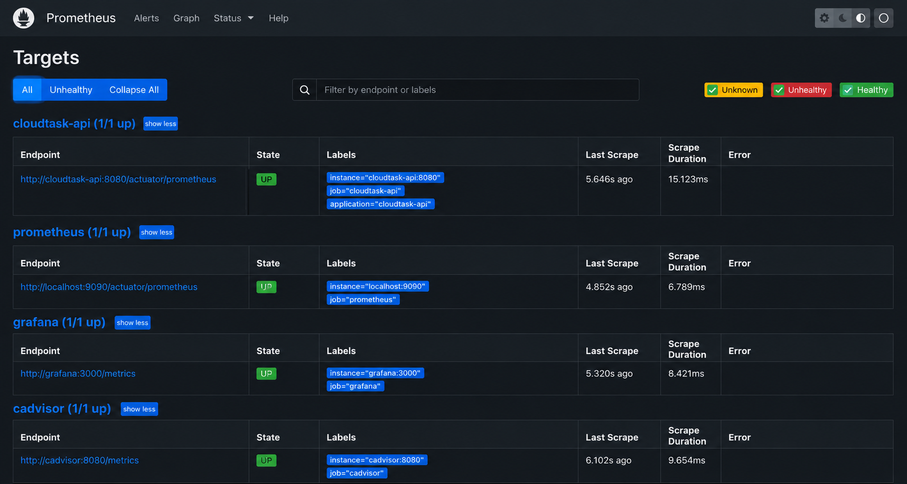
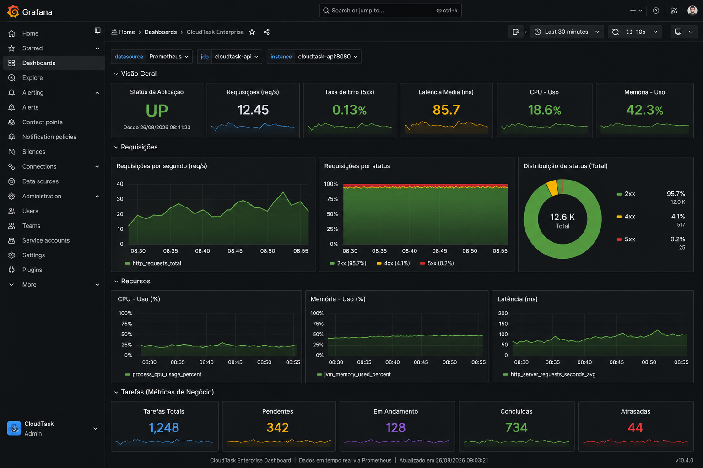
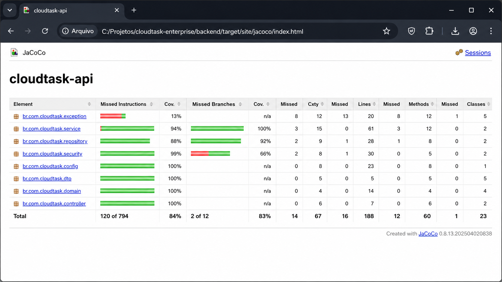

# CloudTask Enterprise

**Cloud-Native Task Management Platform | Java 21 · Spring Boot · React · PostgreSQL · AWS · Terraform · Docker · CI/CD**

[](https://github.com/juceliocoelho2022/cloudtask-enterprise/actions/workflows/backend-ci.yml)
[](https://github.com/juceliocoelho2022/cloudtask-enterprise/actions/workflows/frontend-ci.yml)
[](https://github.com/juceliocoelho2022/cloudtask-enterprise/actions/workflows/terraform-ci.yml)

> **Professional portfolio project** focused on backend engineering, cloud architecture, security, automated testing, observability, Infrastructure as Code and production-oriented delivery practices.

O **CloudTask Enterprise** é uma plataforma de gerenciamento de tarefas desenvolvida como projeto de portfólio profissional para demonstrar conhecimentos de **Engenharia de Software, Java Backend, React, Cloud AWS, DevOps, CI/CD, Segurança, Banco de Dados, Testes e Observabilidade**.

A aplicação já possui runtime real na AWS com **Application Load Balancer, ECS/Fargate, PostgreSQL RDS, ECR, Secrets Manager, CloudWatch Logs e Terraform Remote State em S3**.

---

## Destaques técnicos

| Área | Implementação |
| --- | --- |
| **Backend** | Java 21, Spring Boot 3.5.x, REST API, Spring Data JPA, Hibernate |
| **Security** | Spring Security, JWT, OAuth2 Google/GitHub, Secrets Manager |
| **Frontend** | React 19, Vite, JavaScript, Nginx |
| **Database** | PostgreSQL 17, Flyway, HikariCP, Amazon RDS |
| **Testing** | JUnit 5, Mockito, AssertJ, Testcontainers, JaCoCo |
| **Cloud AWS** | VPC, ECS/Fargate, ECR, RDS, ALB, S3, IAM, CloudWatch |
| **DevOps** | Docker, Docker Compose, GitHub Actions, CI/CD |
| **IaC** | Terraform modular, remote state, locking, environment-based configuration |
| **Observability** | Actuator, Micrometer, Prometheus, Grafana, CloudWatch Logs |
| **API Docs** | OpenAPI 3, Swagger UI, Postman |

> Para uma leitura orientada a recrutadores e avaliação técnica, consulte a [Skills Matrix](docs/skills-matrix.md).

---

## Competências demonstradas

O projeto foi estruturado para demonstrar competências que aparecem com frequência em vagas de **Software Engineer, Java Backend Developer, Full Stack Developer, Cloud Developer e DevOps-oriented Backend Engineer**.

### Engenharia Backend

- Java 21
- Spring Boot 3.5.x
- Spring Web / REST
- Spring Data JPA
- Hibernate
- Jakarta Validation
- arquitetura em camadas
- DTOs
- tratamento global de exceções
- regras de negócio em services
- persistência com repositories

### Segurança e autenticação

- Spring Security
- JWT stateless
- Google OAuth 2.0
- GitHub OAuth App
- Spring Security OAuth2 Client
- CORS configurável
- Secrets Manager no ambiente AWS
- IAM Roles
- GitHub OIDC para CI/CD sem Access Key permanente

### Testes e qualidade

- JUnit 5
- Mockito
- AssertJ
- Testcontainers
- PostgreSQL real nos testes de integração
- JaCoCo
- quality gates com GitHub Actions

### Cloud e DevOps

- Amazon VPC
- Public e Private Subnets
- Security Groups
- Amazon ECR
- Amazon ECS / Fargate
- Amazon RDS PostgreSQL
- Application Load Balancer
- AWS Secrets Manager
- Amazon CloudWatch Logs
- Amazon S3
- Terraform Remote State
- GitHub Actions
- CI/CD
- Docker / Docker Compose

---

## Palavras-chave profissionais

`Java 21` · `Spring Boot` · `Spring Security` · `JWT` · `OAuth2` · `REST API` · `Spring Data JPA` · `Hibernate` · `PostgreSQL` · `Flyway` · `HikariCP` · `React` · `Vite` · `JavaScript` · `Nginx` · `Docker` · `Docker Compose` · `JUnit 5` · `Mockito` · `Testcontainers` · `JaCoCo` · `OpenAPI` · `Swagger` · `Maven` · `Git` · `GitHub` · `GitHub Actions` · `CI/CD` · `AWS` · `Cloud Native` · `Amazon VPC` · `Amazon ECS` · `AWS Fargate` · `Amazon ECR` · `Amazon RDS` · `Application Load Balancer` · `Secrets Manager` · `CloudWatch` · `Terraform` · `Infrastructure as Code` · `S3 Remote State` · `OIDC` · `Prometheus` · `Grafana` · `Micrometer` · `Observability` · `DevOps` · `Software Engineering` · `Backend Development` · `Full Stack Development`

---

## Arquitetura AWS atual

```text
Internet
   |
   v
Application Load Balancer :80
   |
   +-- /* ----------------------> Frontend React + Nginx
   |                              ECS / Fargate :80
   |
   +-- /api/* ------------------> Backend Java 21 + Spring Boot
   +-- /oauth2/* ---------------> ECS / Fargate :8080
   +-- /login/oauth2/* --------->
   +-- /actuator/* ------------->
                                      |
                                      v
                               PostgreSQL 17 / RDS
                               Private Subnets

Amazon ECR
├── Backend Docker Image
└── Frontend Docker Image

AWS Secrets Manager
├── JWT Signing Secret
└── RDS Master Credentials

CloudWatch Logs
├── Backend
└── Frontend

Terraform
└── Remote State em S3 + Native Locking
```

### Decisões de arquitetura

- **ALB com path-based routing** separando frontend e backend no mesmo endpoint público.
- **RDS privado**, sem exposição direta à Internet.
- **Security Groups em camadas**: ALB → frontend/backend → PostgreSQL.
- **Imagens ECR imutáveis**, versionadas por Git SHA.
- **Secrets fora do código**, entregues às tasks pelo Secrets Manager.
- **Terraform state remoto em S3** com locking nativo.
- ambiente `dev` sem NAT Gateway para reduzir custo fixo durante a evolução do portfólio.
- health checks do ALB integrados ao Spring Boot Actuator.

---

## Stack

### Backend

- **Java 21**
- **Spring Boot 3.5.x**
- Spring Web
- Spring Security
- Spring Security OAuth2 Client
- Spring Data JPA
- Hibernate
- Jakarta Validation
- Lombok
- Maven
- Spring Boot Actuator
- Micrometer

### Frontend

- **React 19**
- Vite
- JavaScript / JSX
- CSS3
- Nginx

### Banco de dados

- PostgreSQL 17
- Amazon RDS PostgreSQL
- Flyway
- HikariCP

### Testes

- JUnit 5
- Mockito
- AssertJ
- Testcontainers
- JaCoCo

### Cloud / DevOps

- AWS
- Terraform
- Docker
- Docker Compose
- GitHub Actions
- Amazon ECR
- Amazon ECS / Fargate
- Amazon RDS
- Application Load Balancer
- Secrets Manager
- CloudWatch Logs
- Amazon S3
- GitHub OIDC

### Observabilidade

- Spring Boot Actuator
- Micrometer Prometheus Registry
- Prometheus
- Grafana
- CloudWatch Logs

### API e documentação

- REST / JSON
- OpenAPI 3
- Swagger UI / Springdoc
- Postman

---

## Funcionalidades

- cadastro de usuários
- autenticação com JWT
- login social com Google e GitHub no ambiente local
- CRUD completo de tarefas
- filtro por status
- prioridades
- data de vencimento
- validação de entrada
- tratamento global de exceções
- persistência PostgreSQL
- versionamento de schema com Flyway
- Swagger/OpenAPI
- health checks
- métricas Prometheus
- dashboards Grafana
- logging em CloudWatch no ambiente AWS

---

## Testes e qualidade de código

O backend possui testes unitários e de integração, incluindo fluxo com PostgreSQL real via Testcontainers.

```bash
cd backend
mvn clean verify
```

Cobertura e cenários trabalhados:

- `AuthService`
- `TaskService`
- `GlobalExceptionHandler`
- respostas HTTP 400, 401, 404, 409 e 500
- cadastro de usuário
- login JWT
- criação, listagem, atualização e exclusão de tarefas
- integração Spring Boot + PostgreSQL 17

O relatório JaCoCo é gerado em:

```text
backend/target/site/jacoco/
```

---

## CI/CD

### CI atual

O GitHub Actions executa validações independentes para:

- backend Java/Maven
- frontend React/Vite
- Terraform

### v0.6 — Continuous Delivery

A v0.6 está preparando o fluxo:

```text
Push / Merge na main
        |
        v
Backend + Frontend Quality Gates
        |
        v
GitHub OIDC
        |
        v
AWS IAM Role temporária
        |
        v
Docker Build
        |
        v
Amazon ECR
        |
        v
Nova revisão ECS Task Definition
        |
        v
Rolling Deployment
        |
        v
services-stable
        |
        v
ALB Health Check
```

A autenticação GitHub → AWS utiliza **OIDC**, evitando armazenar AWS Access Keys permanentes no GitHub.

Detalhes: [CI/CD AWS com GitHub OIDC](docs/cicd-aws.md).

---

## Observabilidade

### Ambiente local

- `/actuator/health`
- `/actuator/prometheus`
- Prometheus
- Grafana
- métricas HTTP
- erros HTTP 5xx
- latência p95
- heap JVM
- CPU
- HikariCP
- uptime

### Ambiente AWS

- health check do backend pelo ALB
- logs do backend no CloudWatch
- logs do frontend no CloudWatch
- verificação da conectividade backend → RDS através do Actuator

Na implantação validada da v0.5:

- frontend ECS: **ACTIVE**, `1/1`
- backend ECS: **ACTIVE**, `1/1`
- frontend pelo ALB: **HTTP 200**
- `/actuator/health`: **UP**
- componente PostgreSQL: **UP**

---

## Infraestrutura como Código

A infraestrutura está organizada em módulos Terraform reutilizáveis.

```text
infrastructure/terraform/
├── environments/
│   └── dev/
├── modules/
│   ├── vpc/
│   ├── security-groups/
│   ├── ecr/
│   ├── runtime/
│   └── github-oidc/
└── README.md
```

Práticas utilizadas:

- módulos reutilizáveis
- variáveis por ambiente
- outputs explícitos
- remote state em S3
- locking nativo
- `.terraform.lock.hcl`
- `terraform fmt`
- `terraform validate`
- `terraform plan`
- sem `terraform apply` automático no CI de infraestrutura

---

## Segurança

- JWT signing secret fora do repositório.
- OAuth Client Secrets fora do Git.
- RDS sem acesso público.
- Security Groups com princípio de acesso mínimo entre camadas.
- Secrets Manager para JWT e credenciais RDS no AWS runtime.
- GitHub OIDC para autenticação temporária no pipeline de deploy.
- `iam:PassRole` limitado às roles ECS necessárias.
- Terraform state e arquivos de plano fora do Git.
- ECR com tags imutáveis e scan on push.

> O endpoint `/actuator/prometheus` deve receber proteção adicional antes de um ambiente de produção público definitivo.

---

## Estrutura do repositório

```text
cloudtask-enterprise/
├── .github/workflows/       # CI/CD
├── backend/                 # Java 21 + Spring Boot
├── frontend/                # React + Vite + Nginx
├── infrastructure/terraform # AWS Infrastructure as Code
├── observability/           # Prometheus + Grafana
├── docs/                    # Documentação técnica
├── postman/                 # Coleções de API
├── docker-compose.yml
└── README.md
```

---

## Executar localmente

Para o fluxo OAuth, copie `.env.example` para `.env` e configure as credenciais localmente. Nunca versione secrets reais.

```bash
docker compose up --build -d
```

| Serviço | Endereço local |
| --- | --- |
| Frontend | `http://localhost:5173` |
| Backend | `http://localhost:8080` |
| Swagger | `http://localhost:8080/swagger-ui.html` |
| Health | `http://localhost:8080/actuator/health` |
| Prometheus API | `http://localhost:8080/actuator/prometheus` |
| Prometheus | `http://localhost:9090` |
| Grafana | `http://localhost:3000` |
| PostgreSQL host | `localhost:5433` |

---

## Demonstração visual

### Login



### Cadastro



### Dashboard



### Criar tarefa



### Prometheus



### Grafana



### JaCoCo



> Algumas imagens do diretório de screenshots podem ser mockups conceituais. Resultados de runtime são descritos como reais apenas quando foram efetivamente validados.

---

## Roadmap

| Versão | Status | Entrega |
| :--- | :---: | --- |
| **v0.1** | ✅ Concluída | JWT, CRUD, PostgreSQL, React e Docker |
| **v0.2** | ✅ Concluída | JUnit, Mockito, Testcontainers e JaCoCo |
| **v0.3** | ✅ Concluída | Micrometer, Prometheus e Grafana |
| **Social Login** | ✅ Concluída | Google OAuth 2.0 + GitHub OAuth App + JWT próprio |
| **v0.4** | ✅ Concluída | Terraform + AWS VPC + Subnets + Security Groups + ECR |
| **v0.4.1** | ✅ Concluída | Remote Terraform State em S3 + locking nativo |
| **v0.5** | ✅ Concluída | ECR + ECS/Fargate + RDS + ALB + Secrets Manager + CloudWatch Logs |
| **v0.6** | 🚧 Em desenvolvimento | GitHub Actions + OIDC + ECR + rolling deploy ECS |
| **v0.7** | ⏳ Planejada | MCP Server e integração com IA |
| **v1.0** | ⏳ Planejada | Segurança, resiliência, HTTPS, alertas e documentação final |

---

## Documentação técnica

- [Skills Matrix — competências demonstradas](docs/skills-matrix.md)
- [CI/CD AWS com GitHub OIDC](docs/cicd-aws.md)
- [OAuth Login](docs/oauth-login.md)
- [Guia visual de uso](docs/usage-guide.md)
- [Terraform](infrastructure/terraform/README.md)

---

## Perfil técnico demonstrado pelo projeto

Este repositório evidencia conhecimentos práticos em:

**Java Backend Development · Spring Boot · REST APIs · Authentication & Authorization · SQL/PostgreSQL · Automated Testing · React · Docker · AWS Cloud · Infrastructure as Code · Terraform · CI/CD · GitHub Actions · Observability · Cloud Security · Software Engineering Practices**

O foco não é apenas entregar funcionalidades, mas demonstrar **decisões de arquitetura, segurança, testabilidade, automação, operação e evolução incremental de software**.
