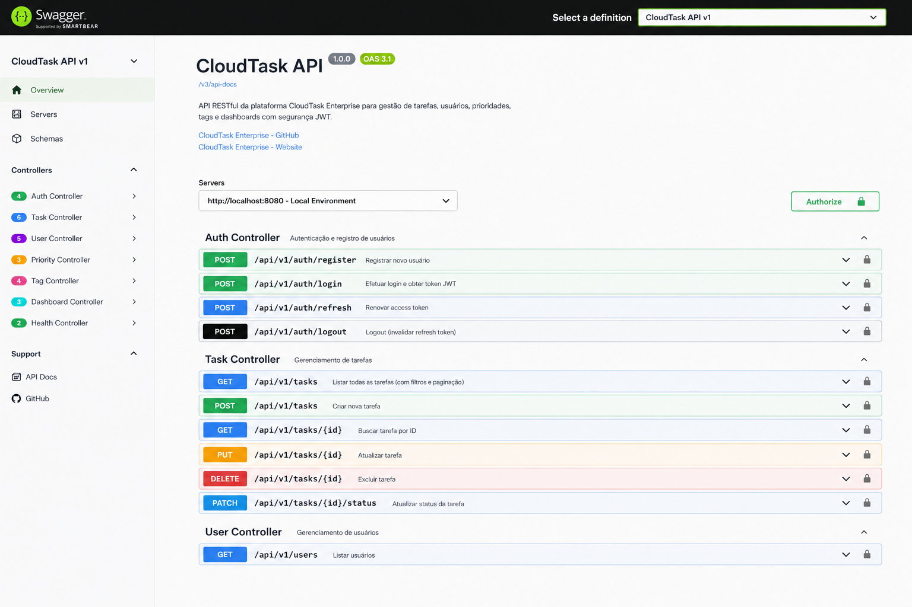

# CloudTask Enterprise

Plataforma cloud-native de gerenciamento de tarefas criada para portfólio profissional, com foco em arquitetura escalável, segurança, automação, qualidade, observabilidade e práticas de produção.

## Tecnologias / GitHub Topics

[**java**](https://github.com/topics/java "Topic: java") · [**spring-boot**](https://github.com/topics/spring-boot "Topic: spring-boot") · [**spring-security**](https://github.com/topics/spring-security "Topic: spring-security") · [**jwt**](https://github.com/topics/jwt "Topic: jwt") · [**rest-api**](https://github.com/topics/rest-api "Topic: rest-api") · [**react**](https://github.com/topics/react "Topic: react") · [**vite**](https://github.com/topics/vite "Topic: vite") · [**postgresql**](https://github.com/topics/postgresql "Topic: postgresql") · [**flyway**](https://github.com/topics/flyway "Topic: flyway") · [**docker**](https://github.com/topics/docker "Topic: docker") · [**docker-compose**](https://github.com/topics/docker-compose "Topic: docker-compose") · [**prometheus**](https://github.com/topics/prometheus "Topic: prometheus") · [**grafana**](https://github.com/topics/grafana "Topic: grafana") · [**micrometer**](https://github.com/topics/micrometer "Topic: micrometer") · [**junit5**](https://github.com/topics/junit5 "Topic: junit5") · [**mockito**](https://github.com/topics/mockito "Topic: mockito") · [**testcontainers**](https://github.com/topics/testcontainers "Topic: testcontainers") · [**jacoco**](https://github.com/topics/jacoco "Topic: jacoco") · [**github-actions**](https://github.com/topics/github-actions "Topic: github-actions") · [**maven**](https://github.com/topics/maven "Topic: maven") · [**nginx**](https://github.com/topics/nginx "Topic: nginx") · [**cloud-native**](https://github.com/topics/cloud-native "Topic: cloud-native")

> Os tópicos acima representam tecnologias já utilizadas na versão atual do projeto. Tecnologias planejadas, como Terraform e AWS, serão adicionadas quando forem efetivamente implementadas.

## Tech Stack

### Backend

- **Java 21**
- **Spring Boot 3.5.x**
- **Spring Web / REST**
- **Spring Data JPA + Hibernate**
- **Spring Security + JWT**
- **Jakarta Validation**
- **Lombok**
- **Spring Boot Actuator**
- **Micrometer**

### Banco de Dados

- **PostgreSQL 17**
- **Flyway**
- **HikariCP**

### Frontend

- **React 19**
- **Vite**
- **JavaScript / JSX**
- **CSS3**
- **Nginx**

### API e Documentação

- **REST / JSON**
- **OpenAPI 3**
- **Swagger UI / Springdoc**
- **Postman**

### Qualidade e Testes

- **JUnit 5**
- **Mockito**
- **Testcontainers**
- **AssertJ**
- **JaCoCo**
- testes de serviços, tratamento de exceções e integração ponta a ponta com PostgreSQL real

### DevOps e Containers

- **Docker**
- **Docker Compose**
- **Git / GitHub**
- **GitHub Actions**

### Observabilidade

- **Spring Boot Actuator**
- **Micrometer Prometheus Registry**
- **Prometheus 3.14.0**
- **Grafana 13.2.0**
- dashboard provisionado automaticamente
- métricas HTTP, JVM, CPU, HikariCP e uptime

### Cloud e Infraestrutura — Roadmap

- **Terraform**
- **AWS ECR**
- **AWS ECS / Fargate**
- **AWS RDS PostgreSQL**
- **Application Load Balancer**
- **AWS Certificate Manager / HTTPS**
- **Route 53**
- **Secrets Manager / SSM Parameter Store**

### IA — Roadmap

- **MCP Server** para integração controlada entre agentes de IA e recursos da plataforma

## Arquitetura v0.3

```text
Browser
   |
   v
React + Nginx
   |
   | HTTP/JSON + JWT
   v
Spring Boot REST API
   |
   | JPA / Hibernate
   v
PostgreSQL

Spring Boot Actuator + Micrometer
   |
   | /actuator/prometheus
   v
Prometheus
   |
   v
Grafana
```

## Demonstração visual

> Algumas imagens abaixo são mockups conceituais usados para demonstrar a evolução visual planejada do produto. Os fluxos funcionais já validados são autenticação JWT, CRUD de tarefas, Swagger/OpenAPI, Prometheus, Grafana, testes automatizados e JaCoCo.

### Login


### Cadastro


### Dashboard


### Criar tarefa


### Swagger / OpenAPI



### Prometheus


### Grafana


### Cobertura de testes


Para o passo a passo completo, consulte o [Guia Visual de Uso](docs/usage-guide.md).

## Funcionalidades v0.1

- cadastro de usuário
- login com JWT
- CRUD de tarefas
- filtro por status
- prioridades e prazo
- validação de dados
- tratamento global de exceções
- Swagger/OpenAPI
- Flyway
- Docker Compose
- CI de backend e frontend

## Qualidade v0.2

A v0.2 adiciona testes automatizados e cobertura de código:

- testes unitários de `AuthService`
- testes unitários de `TaskService`
- testes do `GlobalExceptionHandler`
- cenários 400, 401, 404, 409 e 500
- teste de integração com Spring Boot + Testcontainers + PostgreSQL 17
- fluxo integrado de cadastro, login JWT e CRUD de tarefas
- relatório JaCoCo gerado por `mvn clean verify`
- artifact JaCoCo publicado pelo GitHub Actions
- compatibilidade local do Testcontainers com Docker Desktop 29 via `docker-java.properties`

Para executar:

```bash
cd backend
mvn clean verify
```

> Testcontainers exige Docker disponível no ambiente.

## Observabilidade v0.3

A v0.3 adiciona uma stack de observabilidade local reproduzível:

- endpoint Prometheus em `/actuator/prometheus`
- coleta automática pelo Prometheus a cada 10 segundos
- datasource Prometheus provisionado automaticamente no Grafana
- dashboard `CloudTask Enterprise — Overview` provisionado por arquivo
- taxa de requisições
- taxa de erros HTTP 5xx
- latência HTTP p95
- heap da JVM
- CPU do processo
- conexões ativas HikariCP
- uptime da aplicação

## Executar toda a plataforma

```bash
docker compose up --build -d
```

Serviços:

- Frontend: `http://localhost:5173`
- Backend: `http://localhost:8080`
- Swagger: `http://localhost:8080/swagger-ui.html`
- Health: `http://localhost:8080/actuator/health`
- Métricas Prometheus da API: `http://localhost:8080/actuator/prometheus`
- Prometheus: `http://localhost:9090`
- Grafana: `http://localhost:3000`
- PostgreSQL: `localhost:5432`

### Grafana local

```text
Usuário: admin
Senha: cloudtask
```

No Grafana, abra a pasta **CloudTask** e o dashboard **CloudTask Enterprise — Overview**.

Para gerar tráfego e alimentar os gráficos, use normalmente o frontend, Swagger ou Postman.

## Usuário de demonstração

```http
POST /api/v1/auth/register
Content-Type: application/json

{
  "name": "Jucelio",
  "email": "jucelio@example.com",
  "password": "Senha@123"
}
```

## Roadmap

- **v0.1 ✅** — JWT, CRUD, PostgreSQL, React e Docker
- **v0.2 ✅** — JUnit, Mockito, Testcontainers e JaCoCo
- **v0.3 ✅** — Micrometer, Prometheus e Grafana
- **v0.4** — Terraform
- **v0.5** — AWS ECR + ECS + RDS + ALB
- **v0.6** — CI/CD completo com deploy automatizado
- **v0.7** — MCP Server e integração com IA
- **v1.0** — segurança, resiliência, alertas e documentação final

## Segurança

O segredo JWT e a senha do Grafana definidos no `docker-compose.yml` são exclusivos do ambiente local de desenvolvimento.

Em produção, credenciais devem ser armazenadas em serviços como **AWS Secrets Manager** ou **AWS Systems Manager Parameter Store**. O endpoint `/actuator/prometheus`, embora liberado para a stack local, deve ser protegido por rede privada, autenticação ou política equivalente no ambiente cloud.
